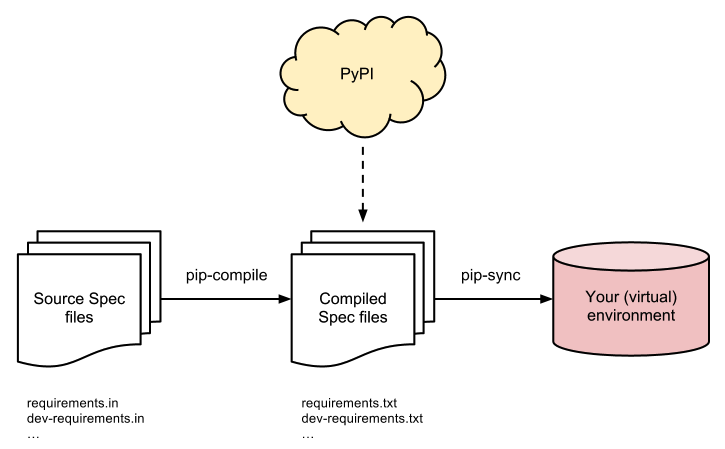

## Python package management with pip-tools

Fabio Fleitas @ Tesorio

August 13, 2017

<https://www.tesorio.com/careers>

---

## How Python package management is done today

---

## Tools of the trade

* pip
* virtualenv
* requirements.txt

---

## Pin the top-level dependencies

```
# requirements.txt

django==1.8.18
djangorestframework==3.5.3
django-extensions==1.7.5
requests==2.18.3
```

---

`$ pip install -r requirements.txt`

---

## Issue with that approach is that it can be non-deterministic

This is because you did not pin sub-dependencies

---

## Most common solution for deterministic builds

`$ pip freeze > requirements.txt`

---

```
# requirements.txt

certifi==2017.7.27.1
chardet==3.0.4
Django==1.8.18
django-extensions==1.7.5
djangorestframework==3.5.3
idna==2.5
requests==2.18.3
six==1.10.0
urllib3==1.22
```

---

### Issue with that approach is that you now have top-level dependencies mixed with sub-dependencies

This will make you life much harder to deal with upgrades/removals of dependencies

---

## The solution: pip-tools

`$ pip install pip-tools`

---

pip-tools = pip-compile + pip-sync

---

### Create a requirements.in
Only include top-level dependencies

```
# requirements.in

django==1.8.18
djangorestframework==3.5.3
django-extensions==1.7.5
requests==2.18.3
```

---

`$ pip-compile requirements.in`

---

```
#
# This file is autogenerated by pip-compile
# To update, run:
#
#    pip-compile --output-file requirements.txt requirements.in
#
certifi==2017.7.27.1      # via requests
chardet==3.0.4            # via requests
django-extensions==1.7.5
django==1.8.18
djangorestframework==3.5.3
idna==2.5                 # via requests
requests==2.18.3
six==1.10.0               # via django-extensions
urllib3==1.22             # via requests
```

---

## pip-sync
`pip-sync` ensures that your virtualenv is synced with your `requirements.txt` and removes everything else. This is important so you don't accidentally have other packages in your virtualenv that may have forgotten to be uninstalled.

---

`$ pip-sync requirements.txt`

---



---

# We're hiring

<https://www.tesorio.com/careers>
